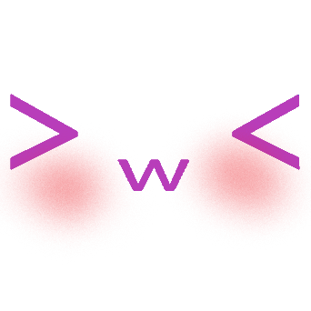

# CutieEngine
CutieEngine is a simple 3D-focused game engine designed for small game development.  It is easy to understand and uses lightweight systems for rendering, scripting, and editor tools.

# How to install from (release)
- (There's no releases yet)
- I am working on it!
# How to run from (source code) (only tested on Windows 10)
- You need python. (the Python version is 3.12 but I guess its okay to use any Version => 3.10)
- Download or clone this repository
- Open the current folder using cmd
- Run in the cmd: `python -m pip install -r requirements.txt`
- After the installation finish: Run `main.py`

# License
Please read the LICENSE file before using CutieEngine.
By using this project, you agree to follow its license terms.
